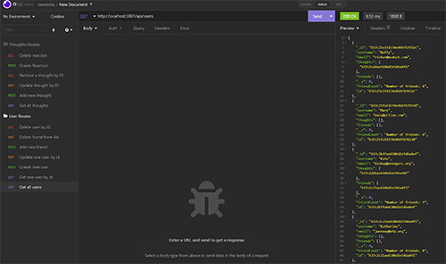

# Social-Network-API
A backend API project for a fictional social media network

## The 18th challenge in the UT-Austin Full Stack Development Bootcamp - Create the backend API for a social media company using MongoDB

___

Moving into the final phase of our bootcamp, the challenge has been to redirect our focus into NoSQL databases. The one we're using is MongoDB. This challenge is meant to push us into understanding the differences between NoSQL and SQL databases while getting us used to using Mongo and Mongoose as an Express module.

This is simply an API so there's no front-end associated with the project. Because of that, we used [Insomnia](https://insomnia.rest/) to test the functionality. 

Once again, since this isn't a deployed application you can watch a video here that shows how it works.

[Video walkthrough of the E-Commerce backend application](https://drive.google.com/file/d/1QBu5pgjVEltettAsZZeMCDN6JuKOzCeC/view)

___

## How to use

At the root level, you'll start up your server by calling server.js. That will fire up the system and link the API to the database.

There are 2 primary routes you can hit on this API

- User = These handle any functions related to managing user accounts and friend lists for users
    - `./api/users`
- Thoughts = These manage Thoughts and Reactions that users post on the site.
    - `./api/thought`

Adding Users is as simple as setting up a POST route and supplying a name and email in the request body.

Any modifications to users or their friend lists requires knowing the id number assigned to them on creation.

Thoughts are slightly more difficult to add since they need the username, Thought text, and User id number passed through the request body.

In all cases, once you know the User Id numbers, you can edit to your heart's content. 

Also notice that if you delete a user with their User Id, any of the Thoughts under that Username will also be deleted.

___

## Changes Made and Lessons Learned

- The biggest lesson for me was just how similar the mechanics are between MongoDb and MySQL. While the functions are very different in how data interacts with each other, the use of Mongoose and Sequelize makes it fairly easy to migrate back and forth.

- I also learned the value in each type of database. There are some cases where a SQL database just makes more sense. In other cases, NoSQL is much easier to use. The main lesson for me is to not use one or the other just because it seems like the trend. Look at the needs and the data and make the best choice based on that.

___

## Possible Future Changes

- While this is a good lesson, I probably won't touch this code directly. Having said that, since I wrote all the code from scratch I do see how it could be very useful as a template if a future project heads this direction.

___

## Credits

Thanks to Leah, Ian, Diem, Negin, and all the other students who keep teaching and talking us through all the twists and turns of coding.

___

## License

MIT License

Copyright (c) 2022 Mark Gardner

Permission is hereby granted, free of charge, to any person obtaining a copy
of this software and associated documentation files (the "Software"), to deal
in the Software without restriction, including without limitation the rights
to use, copy, modify, merge, publish, distribute, sublicense, and/or sell
copies of the Software, and to permit persons to whom the Software is
furnished to do so, subject to the following conditions:

The above copyright notice and this permission notice shall be included in all
copies or substantial portions of the Software.

THE SOFTWARE IS PROVIDED "AS IS", WITHOUT WARRANTY OF ANY KIND, EXPRESS OR
IMPLIED, INCLUDING BUT NOT LIMITED TO THE WARRANTIES OF MERCHANTABILITY,
FITNESS FOR A PARTICULAR PURPOSE AND NONINFRINGEMENT. IN NO EVENT SHALL THE
AUTHORS OR COPYRIGHT HOLDERS BE LIABLE FOR ANY CLAIM, DAMAGES OR OTHER
LIABILITY, WHETHER IN AN ACTION OF CONTRACT, TORT OR OTHERWISE, ARISING FROM,
OUT OF OR IN CONNECTION WITH THE SOFTWARE OR THE USE OR OTHER DEALINGS IN THE
SOFTWARE.
